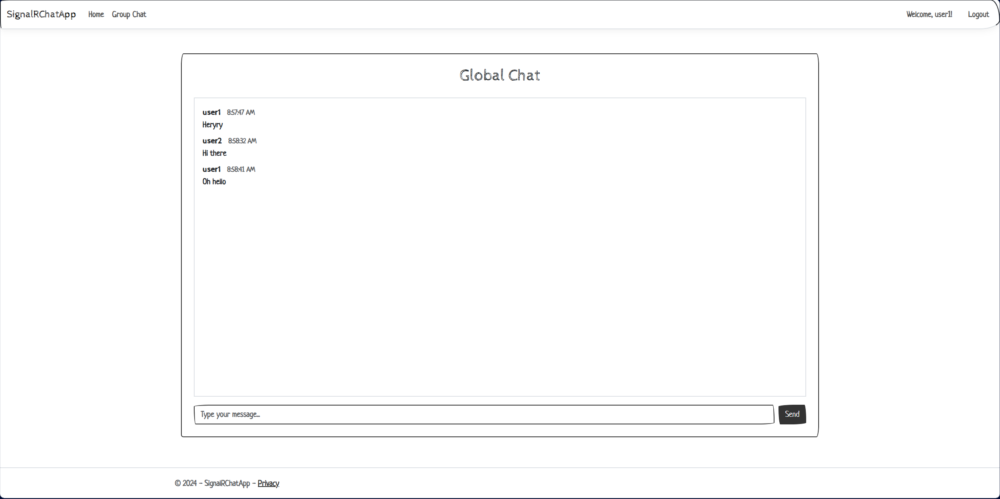

# SignalRChatApp

SignalRChatApp is a real-time chat application built with ASP.NET Core and SignalR. It allows users to register, login, and participate in global and group chats.



## Table of Contents

- [Features](#features)
- [Technologies Used](#technologies-used)
- [Getting Started](#getting-started)
- [Docker Support](#docker-support)
- [Project Structure](#project-structure)
- [Key Components](#key-components)


## Features

- User registration and login
- Global Chat
   - Real-time messaging in a public chat room
   - All users can participate and see messages instantly
- Group Chat
   - Create or join private chat groups
   - Real-time messaging within specific groups
   - Only group members can see and send messages
- Real-time message updates using SignalR

## Technologies Used

- ASP.NET Core 8.0
- SignalR
- Entity Framework Core (In-Memory Database)
- jQuery
- Bootstrap


## Getting Started

### Prerequisites

- .NET 8.0 SDK
- Visual Studio 2022 or Visual Studio Code

### Installation

1. Clone the repository:
   ```
   git clone https://github.com/hoangvu1420/SignalRChatApp.git
   ```

2. Navigate to the project directory:
   ```
   cd SignalRChatApp
   ```

3. Restore the NuGet packages:
   ```
   dotnet restore
   ```

4. Run the application:
   ```
   dotnet run
   ```

5. Open a web browser and navigate to `https://localhost:7103` or `http://localhost:5277` (as specified in the launchSettings.json file).


## Docker Support

You can also run the application using Docker. Here's how:


1. Build and run the Docker containers:
   ```
   docker-compose up --build
   ```

2. Open a web browser and navigate to `http://localhost:8080` to access the application.

3. To stop the containers, use:
   ```
   docker-compose down
   ```

These steps will build and run the SignalRChatApp container as defined in the docker-compose.yml file, exposing the application on port 8080.


## Project Structure

- `Controllers/`: Contains the MVC controllers
- `Hubs/`: Contains the SignalR hub for real-time communication
- `Models/`: Contains the data models
- `Services/`: Contains the business logic and data access services
- `Views/`: Contains the Razor views
- `wwwroot/`: Contains the static files (CSS, JavaScript, libraries)

## Key Components

### ChatHub

The `ChatHub` class (located in `Hubs/ChatHub.cs`) handles real-time messaging:

```
SignalRChatApp/Hubs/ChatHub.cs
startLine: 1
endLine: 33
```

### Program.cs

The `Program.cs` file configures the application services and middleware:

```
SignalRChatApp/Program.cs
startLine: 1
endLine: 60
```

### chat.js

The `chat.js` file (located in `wwwroot/js/chat.js`) handles the client-side SignalR connection and user authentication:

```
SignalRChatApp/wwwroot/js/chat.js
startLine: 1
endLine: 116
```

## Contributing

Contributions are welcome! Please feel free to submit a Pull Request.